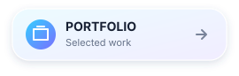
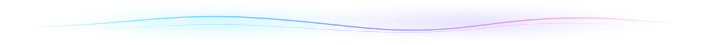
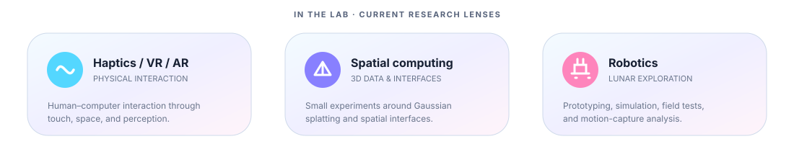

<h1 align="center">Saito Minoru</h1>

R&amp;D engineer and master's student at the <strong>Institute of Science Tokyo</strong> 
Haptics / VR / AR · Robotics · Browser-native research tools

<h2 align="center">Recent activity</h2>

PUBLIC REPOSITORIES · REFRESHED DAILY

<!-- recent:start -->
<table>
<tr>
<td width="72" align="center"></td>
<td><strong><a href="https://github.com/minoru-s/pdf-injection-detector">pdf-injection-detector</a></strong> PDF内のプロンプトインジェクション（見えにくく配置された文字や他のオブジェクトに隠された文字）を検出する静的Webアプリ． </td>
<td width="105" align="right">UPDATED <code>2026-08-04</code></td>
</tr>
<tr>
<td width="72" align="center"></td>
<td><strong><a href="https://github.com/minoru-s/portfolio">portfolio</a></strong> ポートフォリオサイト </td>
<td width="105" align="right">UPDATED <code>2026-08-03</code></td>
</tr>
<tr>
<td width="72" align="center"></td>
<td><strong><a href="https://github.com/minoru-s/mapping-plus">mapping-plus</a></strong> GPSロガーアプリ「マッピング」のデータの閲覧・編集ができる非公式アプリ． </td>
<td width="105" align="right">UPDATED <code>2026-08-01</code></td>
</tr>
<tr>
<td width="72" align="center"></td>
<td><strong><a href="https://github.com/minoru-s/pdf-raster-exporter">pdf-raster-exporter</a></strong> PDFの全ページを画像化してPDFまたは画像形式で出力するWebアプリ．テキスト情報の抹消が目的． </td>
<td width="105" align="right">UPDATED <code>2026-07-30</code></td>
</tr>
</table>
<!-- recent:end -->

<h2 align="center">Applications</h2>

BROWSER-NATIVE TOOLS · CLICK AN ICON TO LAUNCH

&ensp;&ensp;
&ensp;&ensp;
&ensp;&ensp;
&ensp;&ensp;
&ensp;&ensp;

<a href="https://minoru-s.github.io/pdf-injection-detector/"><kbd>PDFender ↗</kbd></a>&ensp;
<a href="https://minoru-s.github.io/mapping-plus/"><kbd>Mapping Plus ↗</kbd></a>&ensp;
<a href="https://minoru-saito-chuo.github.io/mocap/"><kbd>Mocap Plus ↗</kbd></a>&ensp;
<a href="https://minoru-s.github.io/yurutask/"><kbd>YuruTask ↗</kbd></a>&ensp;
<a href="https://minoru-s.github.io/bib-generator"><kbd>BibGenerator ↗</kbd></a>&ensp;
<a href="https://minoru-s.github.io/portfolio/en/"><kbd>Portfolio ↗</kbd></a>

<a href="https://github.com/minoru-s/mocap"><kbd>Mocap Plus · source ↗</kbd></a>&nbsp;
<a href="https://github.com/minoru-s/3dgs"><kbd>3DGS Lab · experiments ↗</kbd></a>&nbsp;
<a href="https://minoru-s.github.io/portfolio/en/research/"><kbd>Research case studies ↗</kbd></a>

I build tools that make physical-world data easier to see, test, and use.

