### Saito Minoru

`R&D ENGINEER / MASTER'S STUDENT`  
Institute of Science Tokyo · Haptics / VR / AR

[PORTFOLIO ↗](https://minoru-s.github.io/portfolio/)　·　[LINKEDIN ↗](https://www.linkedin.com/in/minoru-s)　·　[ALL REPOSITORIES ↗](https://github.com/minoru-s?tab=repositories)

 

## Selected systems

<table>
<tr>
<td width="50%" valign="top">

01 / DOCUMENT INTELLIGENCE

### [PDFender](https://github.com/minoru-s/pdf-injection-detector)

PDFの描画情報から、見えにくい文字や隠された文字を検出。ファイルを外部へ送らず、間接プロンプトインジェクションの手掛かりを可視化します。

<kbd>LOCAL-FIRST</kbd> <kbd>TYPESCRIPT</kbd> <kbd>PDF.JS</kbd> <kbd>PWA</kbd>

**[LAUNCH ↗](https://minoru-s.github.io/pdf-injection-detector/)**

</td>
<td width="50%" valign="top">

02 / SPATIAL DATA

### [Mapping Plus](https://github.com/minoru-s/mapping-plus)

GPSバックアップをヒートマップ化し、位置飛びを見つけて編集。本家互換ファイルまで、ブラウザ内だけで生成します。

<kbd>LOCAL-FIRST</kbd> <kbd>LEAFLET</kbd> <kbd>SQL.JS</kbd> <kbd>GIS</kbd>

**[LAUNCH ↗](https://minoru-s.github.io/mapping-plus/)**

</td>
</tr>
<tr>
<td width="50%" valign="top">

03 / PHYSICAL COMPUTING

### [Mocap Plus](https://github.com/minoru-s/mocap)

OptiTrack / Motiveの実験データを、3D再生・軌跡・速度・スリップ率・ヒートマップへ変換する解析ワークスペース。

<kbd>MOTION CAPTURE</kbd> <kbd>THREE.JS</kbd> <kbd>DATA VIZ</kbd> <kbd>PWA</kbd>

**[LAUNCH ↗](https://minoru-s.github.io/mocap/)**

</td>
<td width="50%" valign="top">

04 / SPATIAL COMPUTING

### [3DGS Lab](https://github.com/minoru-s/3dgs)

動画や写真から3D Gaussian Splattingで空間を再構成。Apple Silicon上で学習し、ローカルビューアで探索できます。

<kbd>3DGS</kbd> <kbd>APPLE SILICON</kbd> <kbd>COLMAP</kbd> <kbd>WEBGL</kbd>

**[SOURCE ↗](https://github.com/minoru-s/3dgs)**

</td>
</tr>
</table>

<strong>＋ MORE TOOLS</strong>

 

| Tool | What it does |
|---|---|
| [PDF Raster Exporter ↗](https://minoru-s.github.io/pdf-raster-exporter/) | PDFをページ画像から再構成し、見えないテキスト情報を除去 |
| [Video Shrinker ↗](https://github.com/minoru-s/video-shrinker) | macOS上で動画をローカル圧縮 |
| [YuruTask ↗](https://minoru-s.github.io/yurutask/) | あえてゆるく使えるタスク管理アプリ |
| [Bib Generator ↗](https://minoru-s.github.io/bib-generator/) | 文献情報からLaTeX引用を生成 |

 

<strong>＋ OPEN SYSTEM PROFILE</strong>

 

| | |
|---|---|
| **Current** | 東京科学大学大学院 工学院 情報通信系 長谷川研究室 |
| **Research** | Haptics · VR / AR · Human–computer interaction |
| **Background** | Lunar exploration rovers · Multi-robot systems in unknown environments |
| **Code** | Python · TypeScript / JavaScript · C · C# · MATLAB |
| **Physical** | Unity · Raspberry Pi · Arduino · OptiTrack / Motive · Fusion 360 · 3D printing |
| **Approach** | Prototype → Measure → Analyze → Iterate |

 

LIVE ACTIVITY ↓ 
Pinned repositories and GitHub's native contribution graph stay current automatically.

