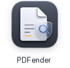
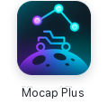
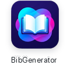
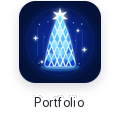

<h1 align="center">Saito Minoru</h1>

R&amp;D engineer and master's student at the <strong>Institute of Science Tokyo</strong> 
Haptics / VR / AR · Robotics · Browser-native research tools

<h2 align="center">Recent activity</h2>

PUBLIC REPOSITORIES · REFRESHED DAILY

<!-- recent:start -->
<table>
<tr>
<td width="72" align="center"></td>
<td><strong><a href="https://github.com/minoru-s/pdf-injection-detector">pdf-injection-detector</a></strong> PDF内のプロンプトインジェクション（見えにくく配置された文字や他のオブジェクトに隠された文字）を検出する静的Webアプリ． </td>
<td width="105" align="right">UPDATED <code>2026-08-05</code></td>
</tr>
<tr>
<td width="72" align="center"></td>
<td><strong><a href="https://github.com/minoru-s/portfolio">portfolio</a></strong> ポートフォリオサイト </td>
<td width="105" align="right">UPDATED <code>2026-08-03</code></td>
</tr>
<tr>
<td width="72" align="center"></td>
<td><strong><a href="https://github.com/minoru-s/mapping-plus">mapping-plus</a></strong> GPSロガーアプリ「マッピング」のデータの閲覧・編集ができる非公式アプリ． </td>
<td width="105" align="right">UPDATED <code>2026-08-01</code></td>
</tr>
<tr>
<td width="72" align="center"></td>
<td><strong><a href="https://github.com/minoru-s/pdf-raster-exporter">pdf-raster-exporter</a></strong> PDFの全ページを画像化してPDFまたは画像形式で出力するWebアプリ．テキスト情報の抹消が目的． </td>
<td width="105" align="right">UPDATED <code>2026-07-30</code></td>
</tr>
</table>
<!-- recent:end -->

<h2 align="center">Applications</h2>

BROWSER-NATIVE TOOLS · CLICK AN ICON TO LAUNCH

&ensp;
&ensp;
&ensp;
&ensp;
&ensp;

<h2 align="center">In the lab</h2>

CURRENT RESEARCH LENSES

<a href="https://minoru-s.github.io/portfolio/en/research/"><strong>Haptics / VR / AR</strong></a> 
Human–computer interaction through touch, space, and perception.  
<a href="https://minoru-s.github.io/portfolio/en/research/"><strong>Spatial computing</strong></a> 
Small experiments around Gaussian splatting and spatial interfaces.  
<a href="https://minoru-s.github.io/portfolio/en/research/"><strong>Robotics</strong></a> 
Prototyping, simulation, field tests, and motion-capture analysis.

<a href="https://github.com/minoru-s/mocap"><kbd>Mocap Plus · source ↗</kbd></a>&nbsp;
<a href="https://github.com/minoru-s/3dgs"><kbd>3DGS Lab · experiments ↗</kbd></a>&nbsp;
<a href="https://minoru-s.github.io/portfolio/en/research/"><kbd>Research case studies ↗</kbd></a>

<h2 align="center">Background</h2>

AFFILIATIONS · EXPERIENCE · TOOLBOX

<h3 align="center">Trajectory</h3>

FROM PHYSICAL SYSTEMS TO HUMAN–COMPUTER INTERACTION

<table width="100%">
<tr>
<td width="128" align="center"><code>NOW</code> 2026.04 —</td>
<td width="872"><strong>Institute of Science Tokyo</strong> Master's student · Hasegawa Laboratory Haptics, VR / AR, and interfaces that connect perception with physical systems.</td>
</tr>
<tr>
<td width="128" align="center"><code>LAB</code> 2025.04 — 2026.03</td>
<td width="872"><strong>Chuo University · Kunii Laboratory</strong> Robotics research developed through prototyping, simulation, and motion-capture analysis.</td>
</tr>
<tr>
<td width="128" align="center"><code>FOUNDATION</code> 2022.04 — 2026.03</td>
<td width="872"><strong>Electrical, Electronic and Communication Engineering</strong> Lunar exploration rovers and multi-robot systems for unknown environments.</td>
</tr>
</table>

<h3 align="center">Working set</h3>

THE SAME LOOP, ACROSS SOFTWARE AND PHYSICAL PROTOTYPES

<table width="100%">
<tr>
<td width="116" align="center"><strong>01</strong> BUILD</td>
<td width="884"><code>Python</code> <code>TypeScript</code> <code>JavaScript</code> <code>C / C#</code> <code>MATLAB</code> <code>R</code> Research software and browser-native tools.</td>
</tr>
<tr>
<td width="116" align="center"><strong>02</strong> PROTOTYPE</td>
<td width="884"><code>Unity</code> <code>Fusion 360</code> <code>Raspberry Pi</code> <code>Arduino</code> <code>3D printing</code> Fast movement from an interaction idea to something testable.</td>
</tr>
<tr>
<td width="116" align="center"><strong>03</strong> MEASURE</td>
<td width="884"><code>OptiTrack / Motive</code> <code>Haptics</code> <code>VR / AR</code> Close the loop with motion, perception, and field observations.</td>
</tr>
</table>

<code>OBSERVE → PROTOTYPE → TEST → SHIP</code> I build tools that make physical-world data easier to see, test, and use.

